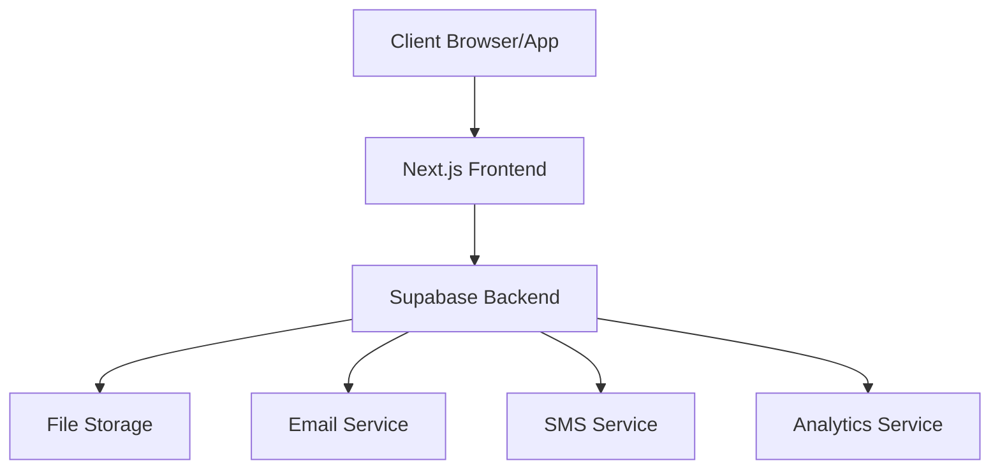
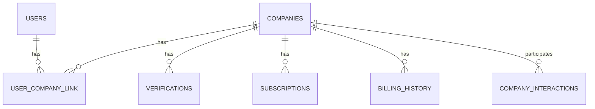

# Architecture Overview

## System Architecture



## Frontend Architecture

### Technology Stack

- **Next.js 14**
  - App Router
  - Server Components
  - Server Actions
  - API Routes

- **TypeScript**
  - Strict type checking
  - Type inference
  - Custom type definitions

- **Tailwind CSS**
  - Utility-first CSS
  - Custom components
  - Responsive design

### Component Structure

```
src/
├── app/
│   ├── (auth)/
│   │   ├── login/
│   │   └── register/
│   ├── dashboard/
│   ├── profile/
│   └── settings/
├── components/
│   ├── common/
│   │   ├── Button/
│   │   ├── Card/
│   │   └── Input/
│   ├── layout/
│   └── features/
├── lib/
│   ├── hooks/
│   ├── utils/
│   └── types/
└── styles/
```

## Backend Architecture

### Supabase Services

1. **Authentication**
   - Email/password
   - OAuth providers
   - Role-based access
   - Session management

2. **Database**
   - PostgreSQL
   - Row Level Security
   - Real-time subscriptions
   - Full-text search

3. **Storage**
   - File uploads
   - Image processing
   - Secure access
   - CDN delivery

4. **Edge Functions**
   - Serverless functions
   - API endpoints
   - Background jobs
   - Webhooks

### Database Architecture



## Security Architecture

### Authentication Flow

1. **User Authentication**
   - Email/password validation
   - OAuth provider authentication
   - JWT token generation
   - Session management

2. **Authorization**
   - Role-based access control
   - Row Level Security policies
   - API endpoint protection
   - Resource permissions

### Data Security

1. **Database Security**
   - Row Level Security
   - Column encryption
   - Audit logging
   - Backup strategy

2. **API Security**
   - Rate limiting
   - CORS policies
   - Input validation
   - Error handling

## Integration Architecture

### External Services

1. **Email Service**
   - Transactional emails
   - Marketing communications
   - Email templates
   - Delivery tracking

2. **SMS Service**
   - Verification codes
   - Notifications
   - Alert systems
   - Delivery status

3. **Analytics Service**
   - User tracking
   - Event logging
   - Performance monitoring
   - Business metrics

### API Architecture

1. **Internal APIs**
   - RESTful endpoints
   - GraphQL queries
   - Real-time subscriptions
   - Background jobs

2. **External APIs**
   - Public API endpoints
   - Webhook integrations
   - Third-party services
   - API documentation

## Deployment Architecture

### Infrastructure

1. **Frontend Deployment**
   - Vercel platform
   - Edge caching
   - Asset optimization
   - CI/CD pipeline

2. **Backend Deployment**
   - Supabase Cloud
   - Database clustering
   - Auto-scaling
   - Monitoring

### Monitoring

1. **Performance Monitoring**
   - Application metrics
   - Database performance
   - API response times
   - Error tracking

2. **Business Monitoring**
   - User analytics
   - Business metrics
   - Usage statistics
   - Growth indicators

## Development Architecture

### Development Environment

1. **Local Setup**
   - Development server
   - Hot reloading
   - Debug tools
   - Test environment

2. **Testing Environment**
   - Unit testing
   - Integration testing
   - E2E testing
   - Performance testing

### CI/CD Pipeline

1. **Continuous Integration**
   - Automated testing
   - Code quality checks
   - Security scanning
   - Build verification

2. **Continuous Deployment**
   - Automated deployment
   - Environment promotion
   - Rollback capability
   - Deployment monitoring 