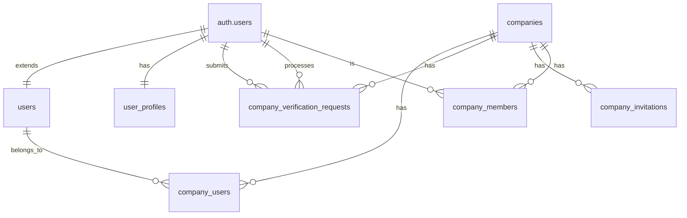

# Database Relationships

## Core Relationships



## Table Dependencies

### User Management Chain
1. `auth.users` (Supabase Auth)
   - Primary authentication and identity
2. `users` (Public)
   - Extends auth.users with application-specific data
3. `user_profiles`
   - Additional user information and preferences
   - Automatically created via trigger on user signup

### Company Management Chain
1. `companies`
   - Core business entity table
   - Referenced by multiple related tables
2. `company_users`
   - Links users to companies
   - Manages primary company relationship
   - Controls user roles and permissions

### Verification Chain
1. `companies`
   - Contains verification status and metadata
2. `company_verification_requests`
   - Tracks verification process
   - Links to submitter and processor
   - Maintains verification history

### Team Management Chain
1. `company_invitations`
   - Manages pending team member invitations
   - Tracks invitation status and expiry
2. `company_members`
   - Stores active team memberships
   - Enforces unique user and email constraints

## Cascading Behaviors

### On User Deletion
- `user_profiles` → CASCADE DELETE
- `company_users` → CASCADE DELETE
- `company_verification_requests` → CASCADE DELETE (submitter)
- `company_verification_requests` → SET NULL (processor)
- `companies.verified_by` → SET NULL

### On Company Deletion
- `company_users` → CASCADE DELETE
- `company_verification_requests` → CASCADE DELETE
- `company_invitations` → CASCADE DELETE
- `company_members` → CASCADE DELETE

## Constraints

### Unique Constraints
1. Company Users:
   - One role per user per company: `UNIQUE(company_id, user_id)`

2. Company Members:
   - One membership per user: `UNIQUE(company_id, user_id)`
   - One email per company: `UNIQUE(company_id, email)`

3. Company Invitations:
   - One active invitation per email: `UNIQUE(company_id, email, status)`

### Check Constraints
1. Company Users:
   - Valid roles: `CHECK (role IN ('owner', 'admin', 'member', 'viewer'))`

2. Member Roles:
   - Valid types: `CHECK (role IN ('admin', 'member'))`

### Foreign Key Constraints
All relationships are enforced with appropriate foreign key constraints and deletion behaviors:
- User references: `REFERENCES auth.users(id)`
- Company references: `REFERENCES companies(id)`
- Cascading deletes where appropriate
- NULL settings for optional relationships

## Indexing Strategy

### Primary Indexes
- All tables have UUID primary keys
- Generated using `gen_random_uuid()`

### Foreign Key Indexes
- All foreign key columns are indexed
- Optimizes join operations

### Special Indexes
1. Companies:
   ```sql
   CREATE INDEX idx_companies_name ON companies(name);
   CREATE INDEX idx_companies_industry_tags ON companies USING gin(industry_tags);
   CREATE INDEX idx_companies_capability_tags ON companies USING gin(capability_tags);
   CREATE INDEX idx_companies_region_tags ON companies USING gin(region_tags);
   ```

2. Company Users:
   ```sql
   CREATE INDEX idx_company_users_company_id ON company_users(company_id);
   CREATE INDEX idx_company_users_user_id ON company_users(user_id);
   CREATE INDEX idx_company_users_role ON company_users(role);
   ```

3. Verification:
   ```sql
   CREATE UNIQUE INDEX idx_company_pending_verification 
   ON company_verification_requests (company_id)
   WHERE status = 'pending';
   ``` 